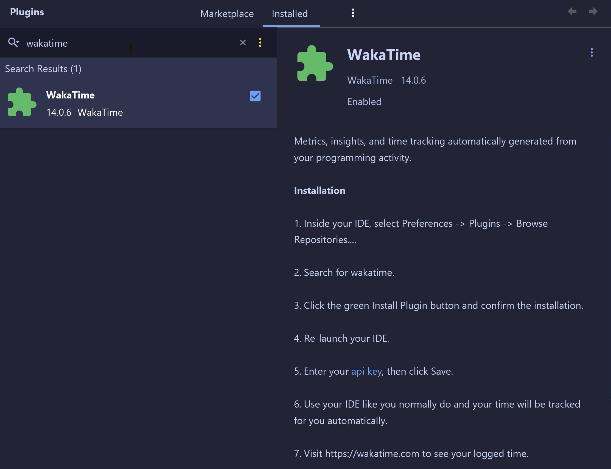

## Profile Readme

A GitHub profile README is a feature of GitHub that allows users to use a Markdown file named README to write details about themselves such as their skills, interests, GitHub stats and showcase it to the GitHub community. It's shown at the top of your GitHub home page, above the pinned repositories. This is a fancy way to showcase one's skills and stats on GitHub.


<!-- TABLE OF CONTENTS -->
<details>
  <summary>Table of Contents</summary>
  <ol>
    <li>
      <a href="#technologies">Technologies</a>
      <ul>
        <li><a href="#icons">Icons</a></li>
      </ul>
    </li>
    <li>
      <a href="#github-stats">Github Stats</a>
      <ul>
        <li><a href="#vercel-stats">Vercel Stats</a></li>
        <li><a href="#wakatime">Wakatime</a></li>
      </ul>
    </li>
    <li><a href="#profile-views">Profile Views</a></li>
  </ol>
</details>


<!-- ABOUT THE PROJECT -->
## Technologies 🖥️

This is a brief section detailing the technologies (programming languages, IDE's, etc...) that you use in a normal basis.

### Icons 👻

You can embed the icons of the technologies that you use.
In my readme, i use the icons found at [Badges-4-Readme](https://github.com/alexandresanlim/Badges4-README.md-Profile.git), a repository that provides a lot of icons related with programming languages, frameworks, IDE's, social media, etc.

Other common icons oftenly used in readme profiles are:
* [Skill Icons](https://github.com/tandpfun/skill-icons)
* [DevIcons](https://github.com/devicons/devicon.git) 

## Github Stats 📈

Dynamically generated stats for your personal use in GitHub.

### Card Stats 📈

My readme uses [Github Readme Stats](https://github.com/anuraghazra/github-readme-stats.git) in order to provide dinamically generated data about my most used programming languages, streak, commits, and other general Github Stats.

This is an example of my Github Stats Card, which are rendered after using the following code in the README.md:
```
 
```

 It is evident that you need to change the username to your GitHub username for it to work.

 


As well, you can customize the look of the card by changing the theme parameter: ```&theme=THEME_NAME``` 
For instance, this is the card render used by setting the theme name to ```radical```:


 


[You can view all available themes here](https://github.com/anuraghazra/github-readme-stats/blob/master/themes/README.md)

### WakaTime 🕛

Wakatime is a plugin that you can install in most of your IDE's in order to monitor the time that you spend on each one of them. 
The WakaTime implementation is also powered by the [Github Readme Stats](https://github.com/anuraghazra/github-readme-stats.git) repository.

First, you'll have to sign in to the [WakaTime](https://wakatime.com/login) website and then provide the WakaTime Key to your IDE, so that it can monitor your statistics.

In the following image, you can view an image that shows the Wakatime plugin in IntelliJ, which is available to most of the Jetbrains powered IDE's.




## Profile Views 👀

In order to see how many times people has clicked on your profile you can use Anton Komarev's [Github Profile Views Counter](https://github.com/antonkomarev/github-profile-views-counter.git). 
