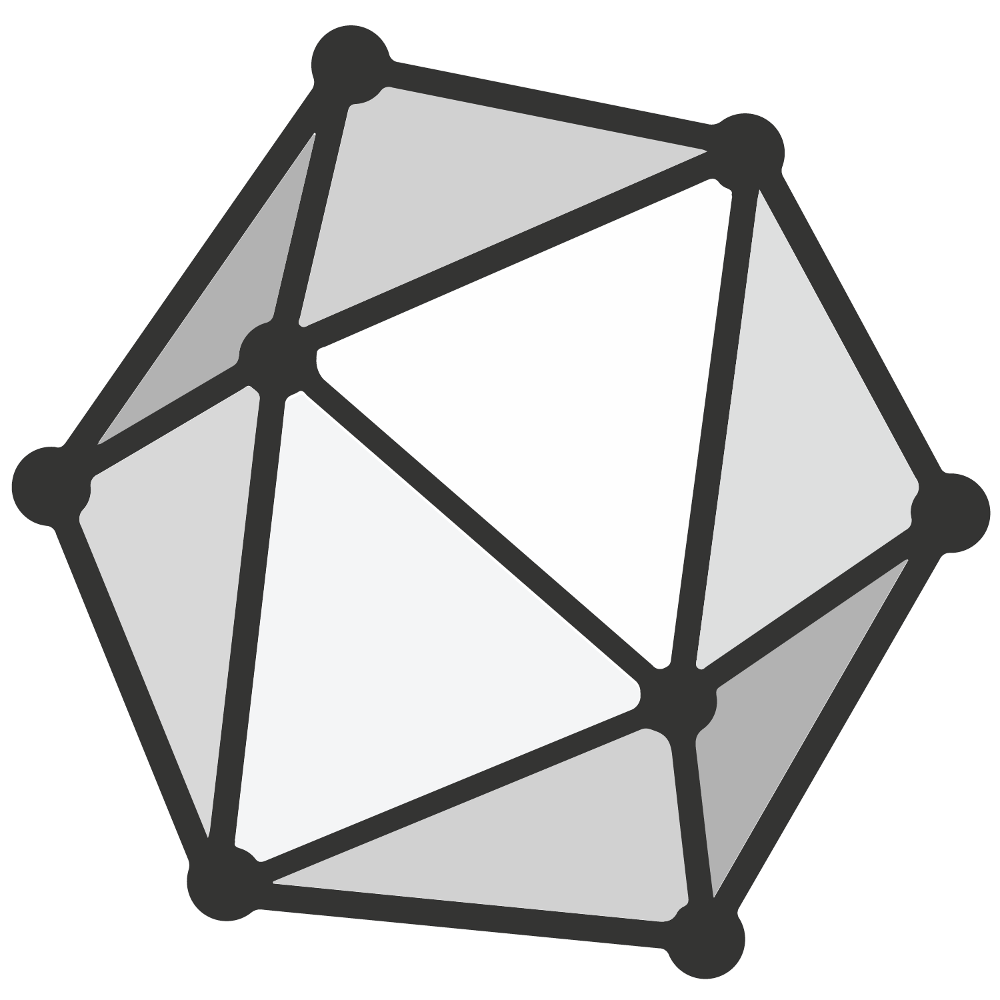

<h1 align="center">
Hey there!

</h1>

Hello, I'm JX Areas! 🤗

I'm an enthusiastic lifelong learner who loves exploring a wide variety of topics, including all things statistics, software engineering & economics.
 

  
## 🦾 Tech Stack

  <code></code>
  <code></code>
  <code></code>
  <code></code>
  <code></code>
  <code></code>
  <code></code>
  <code></code>
  <code></code>
  <code></code>
  <code></code>
  <code></code> 
  <code></code> 
  <code></code> 
  <code></code>
  <code></code>  
  <code></code>
  <code></code>
  <code></code>
  <code></code>
  <code></code>

## 🔎 GitHub Statistics

    
  
  
  
  

 

  

  

